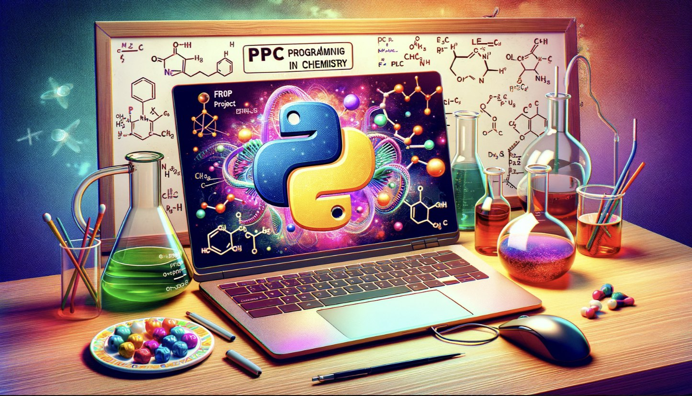

<h1 align="center">
PPC_FROI_Project
</h1>

<br>


## 🔥 Usage

What is it ? 

This project is designed to assist in solving exams questions for the course "Fonctions et Réactions Organiques I," taught by Professor Jieping Zhu at EPFL. It specifically addresses questions related to both reversible and irreversible carbonyl reactions.

Who ?

Our names are Arthur Bongini, Emna Belgharbia and Oriane Azalbert. We're three students who are very interested in organic chemistry and we decided to use this knowledge for our project. When we split up, Oriane was mainly in charge of the main code, the brain that makes everything work. While Emna and Arthur were busy researching and coding the reactions we wanted.

How It Works? 

Upon receiving input in the form of starting materials (i.e., specific molecules and their associated conditions), the application utilizes a pre-defined database of organic reactions to identify the applicable chemical reaction. It then computes and returns the resulting compound, effectively simulating the expected exam response.

Why ? 

 It simplifies identifying reaction pathways and predicting products, thus enhancing study efficiency and accuracy for students preparing their FROI exam.

How ?

After installation, you can import and used our package with the following command on, on a jupyter botebooks for example:
 
```python
# you
from ppc_froi_project.Report import main

# One line to rule them all
main()
```
In addition, this python package returns the name of the reaction if it is present in our database but not coded. Several input cases are possible, such as: starting molecule - condition, first starting molecule - second, first starting molecule - second condition and ending molecule - condition.
Short and sweet, but the real power lies in the detailed documentation grouped together in the various jupyter notebooks placed in the folder of the same name!

Have fun testing reactions! For more information on the types of reactions coded, don't hesitate to consult the Reaction_Functions.ipynb, Lists.ipynb and Dictionnaries.ipynb notebooks! They're packed with information on the patterns of the starting molecules, the conditions of the reactions and the patterns of the final molecules we've coded. Happy coding !

## 👩‍💻 Installation

Create a new environment, you may also give the environment a different name. 

```
conda create -n ppc_froi_project python=3.10 
```

```
conda activate ppc_froi_project
(ppc_froi_project) $ git clone https://github.com/abongini/PPC_FROI_Project.git
(ppc_froi_project) $ cd PPC_FROI_Project
(ppc_froi_project) $ pip install .
```

If you need jupyter lab, install it 

```
(ppc_froi_project) $ pip install jupyterlab
```
Moreover, to use our project, you will need to install some extern python package, see the list of command below:

```
(ppc_froi_project) $ pip install rdkit
(ppc_froi_project) $ pip install IPython
(ppc_froi_project) $ pip install pathlib
```

### Run tests and coverage

```
(conda_env) $ pip install tox
(conda_env) $ tox
```


